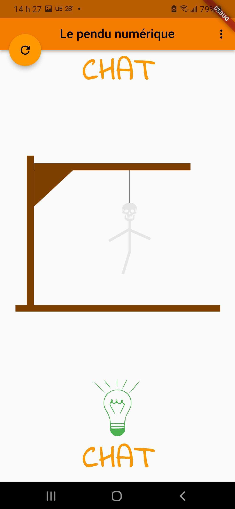
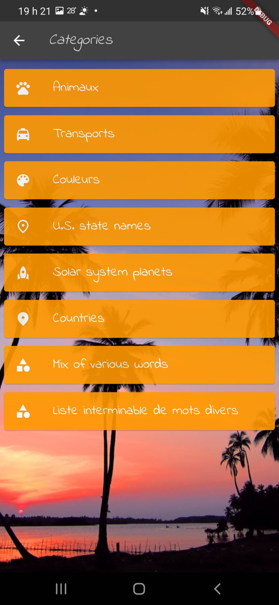

# Guess the text

Words guess game app

 

Free educational app deployable on several native platforms: `Android` & `iOS` (iPhone, Tablets), Webapp, `Linux`, `MacOS`, and `Windows`. The application is an evolving educational game. The goal is to establish native development standards applied to a real world application deployed on production via the `Flutter` framework:
- app technical architecture, solution design and active development
- promote `Flutter` cookbook recipies and `Dart` language best patterns
- responsive layouts, screen design, app theme, typography, dark mode, animations
- local storage, `shared preferences`, devoce NoSQL database like `Sembast`, local SQL db `SQFLite`
- automated unit and behavioral tests, end to end (`e2e`) tests, code coverage report
- evolutive structure of the source code, choice of open source libraries
- integration to `REST` and/or `GraphQL` backend APIs
- dependencies injections pattern (`IoC`) for the whole application
- implementation of best practices, development guide, code reviews, training sessions

## Some screen captures of the implemented features

start game | success | categories | custom chalenge | qr-code
------- | ---------- | ---------- | ---------- | ----------
 |  |  |  | 

## Deployed on production

- [Google Play](https://play.google.com/store/apps/details?id=com.amwebexpert.app.guessthetext.guess_the_text)
- App Store
  - Not yet, will need to create an account and fill in all the forms and go through the approval process
- [Privacy Policy](https://amw-hangman-api.herokuapp.com/privacy-policy.html)
- [Webapp demo](https://amwebexpert.github.io/guess_the_text/)

## Coding standards

Guidelines for developers

* [Coding patterns](docs/sections/coding-standards/patterns.md)
* [Structure and naming](docs/sections/coding-standards/naming.md)
* [Store](docs/sections/coding-standards/store.md)
* [Tests](docs/sections/coding-standards/tests.md)

## BE Api (deployed on Heroku)

- https://amw-hangman-api.herokuapp.com/api/v1/categories
- https://amw-hangman-api.herokuapp.com/api/v1/categories/580b0004-d581-49d1-9c84-bddffdb5f3fd/texts

## Completed so far

List of demonstrated elements inside the codebase, divided by categories:

- [Covered subjects by categories](docs/sections/completed-subjects.md)

## Platforms support

The app supports multiple plateforms (more than just `Android` and `iOS`). See the list of supported platforms and how to add another platform

- [Supported platforms & builds](docs/sections/platforms/platforms-builds.md)

## Usefull VSCode & Flutter CLI operations

Running `e2e` tests, re-generate `.g.dart` files, coverages reports and many other commands

- [Usefull VSCode features & command line operations](docs/sections/usefull-commands.md)

## Contributors

We are actually limiting the number of contributors (so dont take that personnaly) since this project:
- has to refine it's roadmap and goals
- we are in the process of adding a lot of assets to improve the onboarding process
- coding conventions have to be defined
- the developer documentation will be re-structured soon
