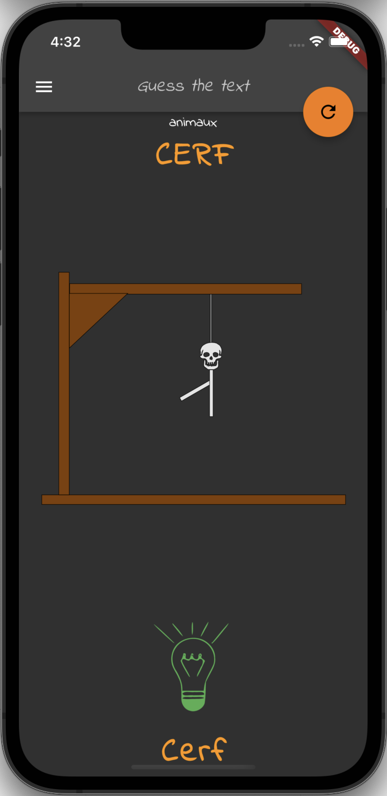
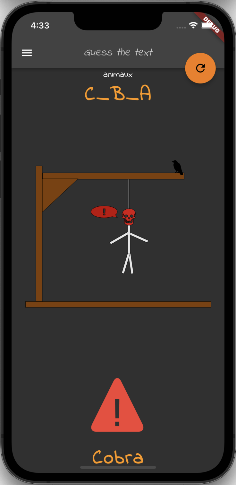
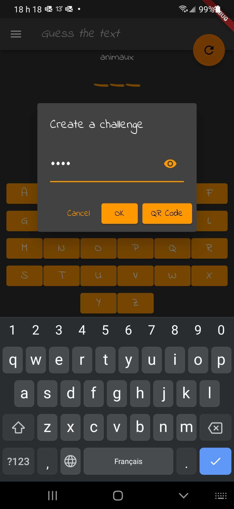

# guess_the_text

Words guess game app in `Flutter`

Free mobile application originally created to learn the `Flutter` framework in my spare time.

The goal is to learn a technology at the same time as providing a fun and scalable educational tool. The source code of this application is available and may also serve as a learning base for training sessions in `Dart` programming with `Flutter`!

## Contributors

We are actually limiting the number of contributors (so dont take that personnaly) since this project:
- has to refine it's roadmap and goals
- we are in the process of adding a lot of assets to improve the onboarding process
- coding conventions have to be defined
- the developer documentation will be re-structured soon

## Some screen captures of the implemented features

success | failure | custom chalenge | qr-code
------- | ---------- | ---------- | ----------
 |  |  | 

## Deployed on production

- [Google Play](https://play.google.com/store/apps/details?id=com.amwebexpert.app.guessthetext.guess_the_text)
- App Store
  - Not yet, will need to create an account and fill in all the forms and go through the approval process
- [Privacy Policy](https://amw-hangman-api.herokuapp.com/privacy-policy.html)
- [Webapp demo](https://amwebexpert.github.io/guess_the_text/)

## Coding standards

Guidelines for developers

* [Structure and naming](./naming.md)
* [Coding patterns](./patterns.md)
* [Store](./store.md)
* [Tests](./tests.md)

## BE Api (deployed on Heroku)

- https://amw-hangman-api.herokuapp.com/api/v1/categories
- https://amw-hangman-api.herokuapp.com/api/v1/categories/580b0004-d581-49d1-9c84-bddffdb5f3fd/texts

## Completed so far

List of demonstrated elements inside the codebase, divided by categories:

- [Covered subjects by categories](docs/sections/completed-subjects.md)

## Usefull VSCode commands

    Command-Shift-P > Dart: Open DevTools Network Page
    Command-Shift-P > Dart: Restart Analysis Server

## Usefull command lines

### environment info listing

    echo $FLUTTER_HOME/bin/cache/artifacts
    ll $FLUTTER_HOME/bin/cache/artifacts
    rm -rf $FLUTTER_HOME/bin/cache/artifacts
    flutter doctor -v
    which flutter

### clean and rebuild

    flutter clean
    flutter pub get
    flutter run

### unit tests, widget and integration tests, e2e

    flutter test -r expanded
    flutter test -r expanded test/features/game/letter.widget_test.dart
    flutter test integration_test/app_test.dart
    flutter test integration_test

Steps to see test coverage of the project:

    # Generate code coverage (will be located at 'coverage/lcov.info')
    flutter test --coverage

    # Generate html for test coverage
    # You will need to have lcov installed (`sudo apt install lcov`, `brew install lcov`)
    genhtml coverage/lcov.info -o coverage/html

    # Open the html that's generated
    open coverage/html/index.html

If you want to see test coverage in vscode, take a look at following extensions that can help you out:
- [Flutter Coverage](https://marketplace.visualstudio.com/items?itemName=Flutterando.flutter-coverage) : Calculates test coverage for flutter
- [Coverage Gutters](https://marketplace.visualstudio.com/items?itemName=ryanluker.vscode-coverage-gutters) : Shows you covered and uncovered lines

### Start headless android emulator before running e2e tests

    emulator -list-avds
    emulator -avd  Pixel_5_API_29 -no-audio -no-window

- https://docs.flutter.dev/testing/integration-tests
- [e2e demo recording here](docs/sections/training/recordings/e2e-tests-demo-flutter.mov)

### Mockito re-generate `.g.dart` mocks files

    flutter pub run build_runner build
    flutter pub run build_runner build --delete-conflicting-outputs

- https://docs.flutter.dev/cookbook/testing/unit/mocking

### MobX re-generate `.g.dart` store files

    flutter packages pub run build_runner build

### Platforms support

- [Add support for a new platform](https://stackoverflow.com/a/66214067/704681)

    flutter create --platforms=web,macos .

## Build & Publish Webapp

Adjust the semversion of `pubspec.yaml` first, then generate the binary

    flutter clean
    flutter pub get
    flutter build web --release --base-href=/guess_the_text/

Update the online demo deployed as GitHub pages by doing this additional step:
- copy the build result from `/build/web` folder into the `/docs` folder
- git add .
- git commit -m"docs: new online demo web release"
- git push

- [Build and release a web app](https://docs.flutter.dev/deployment/web)

then the webapp will be available under `/build/web` folder

## Build & Publish to Google Play

Adjust the semversion of `pubspec.yaml` first, then generate the binary

    flutter clean
    flutter pub get
    flutter build appbundle --release

Tag creation commands

    git commit -m"feature: my super feature"
    git push
    git tag <my-super-tag>
    git push origin --tags

# Build & Run Linux build

To create a build for linux, run following command:

    flutter build linux

Flutter will build the application for linux, an executable will be found at following path:

    /build/linux/x64/release/bundle

From there, just run the `guess_the_text` executable to run the build!

## Start Flutter app on Simulator or a specific device

    open -a Simulator
    xcrun simctl list
    flutter devices
    flutter run -d "iPhone 13"
    flutter run -d "SM A505W"

## Usefull references

- [Build and release an Android app](https://docs.flutter.dev/deployment/android)
- [App localization](https://docs.flutter.dev/development/accessibility-and-localization/internationalization)
- [Flutter locales explained](https://stackoverflow.com/a/62825776/704681)
- [App name update](https://stackoverflow.com/a/56039224/704681)
- [App icons generation](https://pub.dev/packages/flutter_launcher_icons)
- [Existing Dart language extensions](https://pub.dev/packages/dartx)
- [Platform conditional widget rendering - Material / Cupertino management](https://pub.dev/packages/flutter_platform_widgets)
- [Platform conditional widget rendering - Medium article](https://medium.com/flutter/do-flutter-apps-dream-of-platform-aware-widgets-7d7ed7b4624d)

## Troubleshothing

- [Execution failed for task ':app:compileFlutterBuildRelease'](https://github.com/flutter/flutter/issues/64334)
- [App icons generation Troubleshothing](https://stackoverflow.com/questions/70580684/flutter-launcher-icons-not-working-unhandled-exception-formatexception-invalid)
- [Your Code installation appears to be corrupt. Please reinstall](https://stackoverflow.com/a/57712635/704681)
- [Multiple git repository](https://stackoverflow.com/questions/3225862/multiple-github-accounts-ssh-config)
- `app_localizations.dart` / `AppLocalizations` generated i18n artefacts not found
  - Command-Shift-P > Dart: Restart Analysis Server
  - this will re-detect `.g.dart` localization files
- CORS issues for web platform support
  - rm $FLUTTER_HOME/bin/cache/flutter_tools.stamp
  - code $FLUTTER_HOME/packages/flutter_tools/lib/src/web/chrome.dart
  - add '--disable-web-security' as per [instructions here](https://stackoverflow.com/a/66879350/704681)
- [Error: Unsupported operation: Platform._localeName](https://stackoverflow.com/a/69922286/704681)

## Hangman gaming resources

- [Wikitionaire](https://fr.wiktionary.org/wiki/Wiktionnaire:Liste_de_1750_mots_fran%C3%A7ais_les_plus_courants#top-page)
- [WikiMedia dev portal](https://developer.wikimedia.org/use-content/content/)
- [Huge free french words list](https://www.freelang.com/dictionnaire/dic-francais.php#google_vignette)
- [Another Flutter Hangman project](https://github.com/tavasolireza/Hangman-Game-Flutter)
- [English food list](https://www.wordnik.com/lists/food--21)
- [English words list](https://github.com/Xethron/Hangman/blob/master/words.txt)
- [Happy robot 1](https://freesvg.org/happy-robot)
- [Happy robot 2](https://freesvg.org/happy-robot-remix)
- [Happy robot 3](https://freesvg.org/1528841367)
