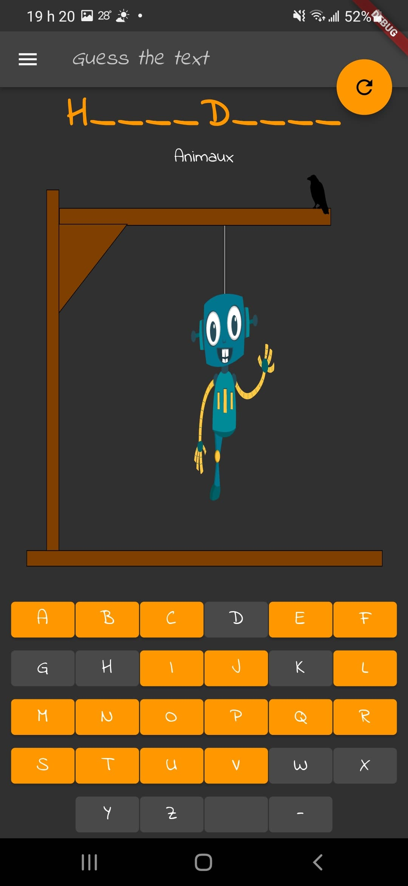

# guess_the_text

Words guess game app

 

Free educational app deployable on several native platforms: Linux, Android, iOS (iPhone, Tablets), Webapp, and soon MacBook and Windows. The application is an evolving educational game. The goal is to establish native development standards applied to a real world application deployed on production via the Flutter framework:
- app technical architecture, solution design and active development
- promote Flutter cookbook recipies and Dart language best patterns
- screen and animation design, theme, typography, dark mode, preferences, local persistence
- automated unit and behavioral tests, end to end tests, code coverage report
- evolutive structure of the source code, choice of open source libraries
- integration of Rest and/or GraphQL APIs
- dependencies injections pattern (IoC) for the whole application
- implementation of best practices, development guide, code reviews, training sessions

## Contributors

We are actually limiting the number of contributors (so dont take that personnaly) since this project:
- has to refine it's roadmap and goals
- we are in the process of adding a lot of assets to improve the onboarding process
- coding conventions have to be defined
- the developer documentation will be re-structured soon

## Some screen captures of the implemented features

start game | success | categories | custom chalenge | qr-code
------- | ---------- | ---------- | ---------- | ----------
 |  |  |  | 

## Deployed on production

- [Google Play](https://play.google.com/store/apps/details?id=com.amwebexpert.app.guessthetext.guess_the_text)
- App Store
  - Not yet, will need to create an account and fill in all the forms and go through the approval process
- [Privacy Policy](https://amw-hangman-api.herokuapp.com/privacy-policy.html)
- [Webapp demo](https://amwebexpert.github.io/guess_the_text/)

## Coding standards

Guidelines for developers

* [Coding patterns](docs/sections/coding-standards/patterns.md)
* [Structure and naming](docs/sections/coding-standards/naming.md)
* [Store](docs/sections/coding-standards/store.md)
* [Tests](docs/sections/coding-standards/tests.md)

## BE Api (deployed on Heroku)

- https://amw-hangman-api.herokuapp.com/api/v1/categories
- https://amw-hangman-api.herokuapp.com/api/v1/categories/580b0004-d581-49d1-9c84-bddffdb5f3fd/texts

## Completed so far

List of demonstrated elements inside the codebase, divided by categories:

- [Covered subjects by categories](docs/sections/completed-subjects.md)

## Usefull VSCode commands

    Command-Shift-P > Dart: Open DevTools Network Page
    Command-Shift-P > Dart: Restart Analysis Server

## Usefull command lines

### environment info listing

    echo $FLUTTER_HOME/bin/cache/artifacts
    ll $FLUTTER_HOME/bin/cache/artifacts
    rm -rf $FLUTTER_HOME/bin/cache/artifacts
    flutter doctor -v
    which flutter

### clean and rebuild

    flutter clean
    flutter pub get
    flutter run

### unit tests, widget and integration tests, e2e

    flutter test -r expanded
    flutter test -r expanded test/features/game/letter.widget_test.dart
    flutter test integration_test/app_test.dart
    flutter test integration_test

Steps to see test coverage of the project:

    # Generate code coverage (will be located at 'coverage/lcov.info')
    flutter test --coverage

    # Generate html for test coverage
    # You will need to have lcov installed (`sudo apt install lcov`, `brew install lcov`)
    genhtml coverage/lcov.info -o coverage/html

    # Open the html that's generated
    open coverage/html/index.html

If you want to see test coverage in vscode, take a look at following extensions that can help you out:
- [Flutter Coverage](https://marketplace.visualstudio.com/items?itemName=Flutterando.flutter-coverage) : Calculates test coverage for flutter
- [Coverage Gutters](https://marketplace.visualstudio.com/items?itemName=ryanluker.vscode-coverage-gutters) : Shows you covered and uncovered lines

### Start headless android emulator before running e2e tests

    emulator -list-avds
    emulator -avd  Pixel_5_API_29 -no-audio -no-window

- https://docs.flutter.dev/testing/integration-tests
- [e2e demo recording here](docs/sections/training/recordings/e2e-tests-demo-flutter.mov)

### Mockito re-generate `.g.dart` mocks files

    flutter pub run build_runner build
    flutter pub run build_runner build --delete-conflicting-outputs

- https://docs.flutter.dev/cookbook/testing/unit/mocking

### MobX re-generate `.g.dart` store files

    flutter packages pub run build_runner build

### Platforms support

- [Add support for a new platform](https://stackoverflow.com/a/66214067/704681)

    flutter create --platforms=web,macos .

## Build & Publish Webapp

- create a branch
- adjust the semversion of `pubspec.yaml` first
- execute the script: `./scripts/build-web.sh`. Then the webapp will be available under `/build/web` folder.

Update the online demo deployed as GitHub pages by doing this additional step:

- execute the script: `./scripts/publish-web.sh`

### References

- [Build and release a web app](https://docs.flutter.dev/deployment/web)

## Build Android bundle

- create a branch
- adjust the semversion of `pubspec.yaml` first
- execute the script: `./scripts/build-android.sh`. Then the android bundle will be available under `/build/app/outputs/bundle/release/app-release.aab` folder.
- publish the app on Google Play by uploading the `.abb` file from the Google Play Console

## Build & Run Linux build

- create a branch
- adjust the semversion of `pubspec.yaml` first
- execute the script: `./scripts/build-linux.sh`. Flutter will build the application for linux, an executable will be found at following path: `/build/linux/x64/release/bundle`

From there, just run the `guess_the_text` executable to run the build!

## Start Flutter app on Simulator or a specific device

    open -a Simulator
    xcrun simctl list
    flutter devices
    flutter run -d "iPhone 13"
    flutter run -d "SM A505W"

